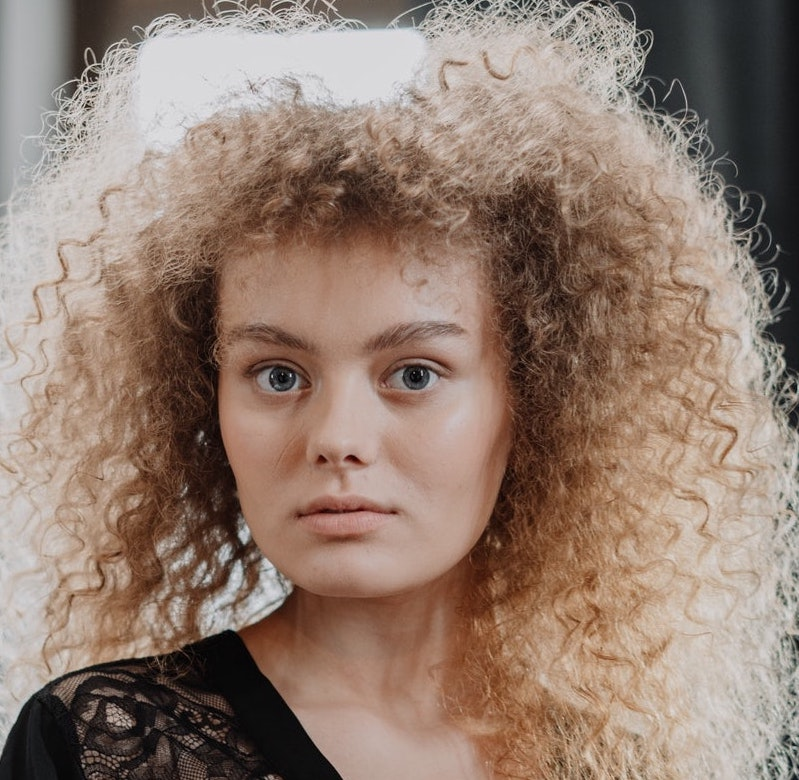
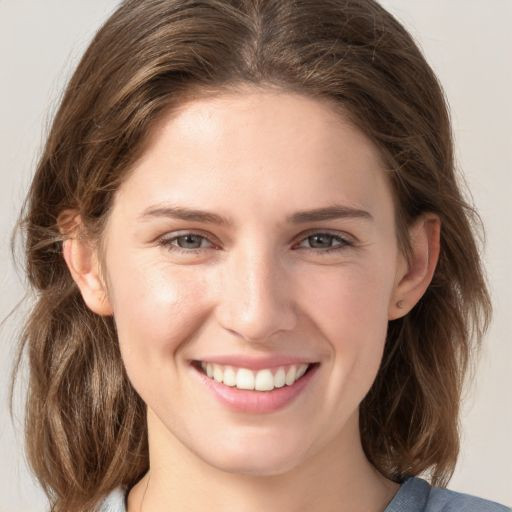
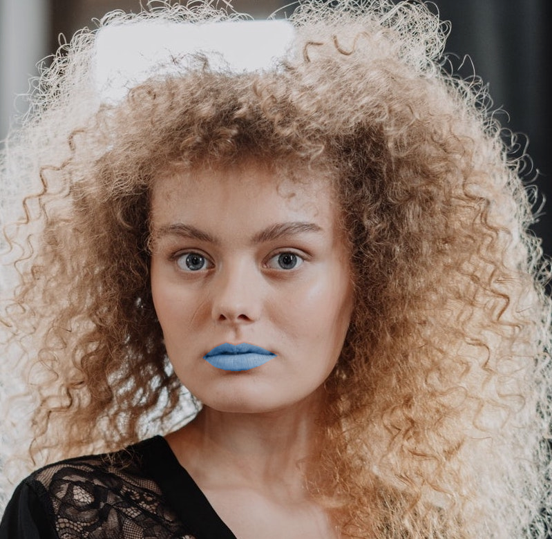
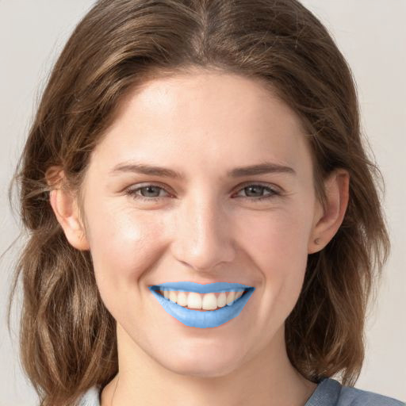
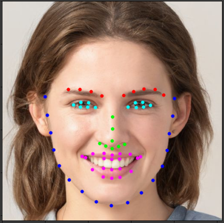
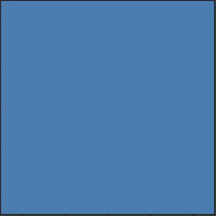
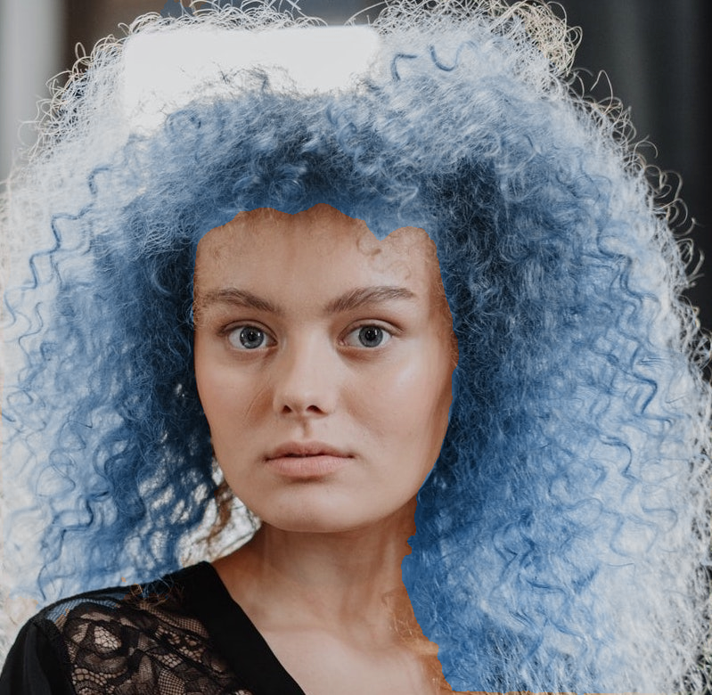
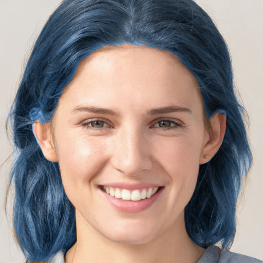
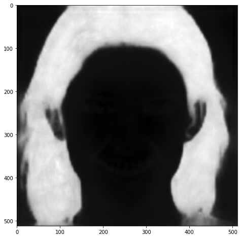

# Virtual-Make-Up

Project I worked on using Dlib and a convolutional network to segment the lips and the face of a person and then perform a color swap. The entire project was done in Google Colab inside my google drive.

I've specified what versions open keras, numpy, opencv, etc. I'm using.

```
These are the two image I used as my test images. I've included them in this github page
```



## Lip Color Swap

Lip color swap with Dlib 68 point landmark detector!\
Results:\


- Requirements(version I used):
  - OpenCV(4.1.2)
  - Numpy(1.18.5)
  - Dlib(19.18.0)
  - Matplotlib(3.2.2)
  - 
    - The file is about 95mb, I couldn't upload it to Github, the link is from someone else's github. Or you can download it somewhere else

## How it works


### Obtaining the facial landmarks

The first step is to use facial landmark detection from the image of the face. Using the 68 face predictor model settings, the ```face detector``` and ```landmark detector``` is loaded from dlib.

```
# Landmark model location
PREDICTOR_PATH =  "shape_predictor_68_face_landmarks.dat"

# Get the face detector
faceDetector = dlib.get_frontal_face_detector()
# The landmark detector is implemented in the shape_predictor class
landmarkDetector = dlib.shape_predictor(PREDICTOR_PATH)
```

Using ```getLandmarks``` from ```faceblendcommon```, the 68 landmark points are obtained from the face.

```
points = fbc.getLandmarks(faceDetector, landmarkDetector, img)
```


From the 68 points, we obtain the points for the lips. The lips start from point 49 to point 68. The lips require to be segmented as the upperlips and lowerlips, otherwise the entire mouth will be colored out.

OpenCV's ```pollyFill``` function will used to create the mask for the upper and lower lips, but before the mask can be made, the points have to be re-ordered like a vector so that ```pollyFill``` will draw the mask correctly.

```
# ordered set of points to draw the mask
upperlips = points[48:55] + points[60:65][::-1]
lowerlips = points[48:49] + points[54:60][::-1] + points[64:]
```

Before we can use ```polyFill``` however, we need to convert them from an array of objects to a numpy array, otherwise you will get an error.

```
uHull = [[p[0],p[1]] for p in upperlips]
lHull = [[p[0],p[1]] for p in lowerlips]
uHull = np.array(uHull)
lHull = np.array(lHull)
```

build the mask for the lips
```
row, col, _ = choice.shape
mask = np.zeros((row, col), dtype=choice.dtype)

cv2.fillPoly(mask, [uHull], (255));
cv2.fillPoly(mask, [lHull], (255));

bit_mask = mask.astype(np.bool)
```


Create a pixel of the color. This pixel is a (1,1,3) shaped objects where each dimension holds a color of the RGB. This pixel will then be converted from the RGB to HSL color space
```
# Create the pixel container
pixel = np.zeros((1,1,3), dtype=np.uint8)
r_, g_, b_ = 0, 1, 2

# set the pixel's RGB to the color's RGB
pixel[:,:,r_], pixel[:,:,g_], pixel[:,:,b_] = color[r_], color[g_], color[b_]
```


what has been accomplished:
- Obtaining the points for the upper and lower lips
- Converting the points to a numpy array for ```polyFill```
- Creating a boolean mask for the lips
- Creating a pixel container for the RGB color

### Color Swaping

To perform the color swap, image and pixel are converted from RGB to HSL color space. The color space conversion is done so that the image will retain its luminance and saturation values while only swaping the hue. The hue contains the color of the image, hence how the color swap works.
```
# Create a copy of the original image
out = choice.copy()

# Convert the images from RGB to HLS
pixel_hsl = cv2.cvtColor(pixel, cv2.COLOR_RGB2HLS)
outhsv = cv2.cvtColor(out,cv2.COLOR_RGB2HLS)

# Hue channel of the image
channel = 0

# extract the hue channels
hue_img = outhsv[:,:,channel]
hue_pixel = pixel_hsl[:,:,0]

# Perform the color swap
hue_img[bit_mask] = hue_pixel[0,0]

# Convert back from HLS to RGB color space
out = cv2.cvtColor(outhsv,cv2.COLOR_HLS2RGB)
```
Resulting image


## Hair Color Swap

- Requirements:
  - 
  - Keras(2.4.3)
 
Hair color swap with a convolutional neural network. Credits to [thangtran480](https://github.com/thangtran480) for the hair detector.

Results:\


### Helper method

This method is code taken fom the author of the hair detector cnn.

```
def predict(image, height=224, width=224):
    im = image.copy()
    im = im / 255
    im = cv2.resize(im, (height, width))
    im = im.reshape((1,) + im.shape)
    
    pred = model.predict(im)
    mask = pred.copy()
    mask = mask.reshape((224, 224,1))
    row, col, _ = image.shape
    mask = cv2.resize(mask, (col, row))
    return mask
```

### How it works

The hair detector model is loaded.

```
model = keras.models.load_model('./models/hairnet_matting.hdf5')
```
The neural network predicts where is hair in the image. Then a threshold 

```
# Don't overwrite the image
img = choice.copy()

# Predict the mask from the image
hairmask = predict(img)
```



The resulting image is a single dimension, ```(512, 512)``` shaped image in this case, ```float``` image. The mask isn't complete yet, we have to pick a threshold, ```0.7``` in this case and then perform a conversion from ```float``` to ```boolean```. And then we will finally have a boolean mask.

```
# Mask Creation
threshold = 0.7
bit8_hairmask = hairmask.copy()

# Convert the float hairmask into uint8 values
bit8_hairmask[bit8_hairmask > threshold] = 255
bit8_hairmask[bit8_hairmask <= threshold] = 0

# convert unint8 mask to a boolean mask
bin_hairmask = bit8_hairmask.astype(np.bool)
```

The boolean mask is completed, now we create a 1x1 pixel image and with the chosen color. This is the same step that was done in the ```lip color change```, we're making a ```1x1``` pixel with the color in RGB and converting that single pixel from the RGB space to the HLS space.

```
pixel = np.zeros((1,1,3), dtype=np.uint8)
r_ = 0
g_ = 1
b_ = 2

pixel[:,:,r_], pixel[:,:,g_], pixel[:,:,b_] = color[r_], color[g_], color[b_]
```

Convert both the image and the pixel from RGB to HLS space. Finally, swap the ```hue``` of the 

```
out = choice.copy()

# Convert image of person from RGB to HLS
pixel_hsl = cv2.cvtColor(pixel, cv2.COLOR_RGB2HLS)
hls_img = cv2.cvtColor(out, cv2.COLOR_RGB2HLS)
channel = 0
channel = 0

# extract the hue channels
hue_img = outhsv[:,:,channel]
hue_pixel = pixel_hsl[:,:,0]

hue_img[bin_hairmask] = hue_pixel[0,0]

out = cv2.cvtColor(outhsv,cv2.COLOR_HLS2RGB)
```


